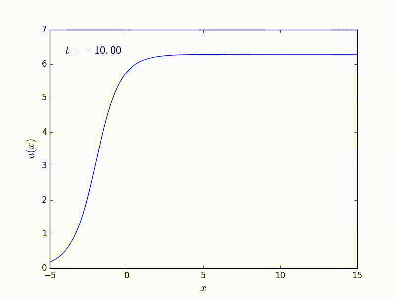
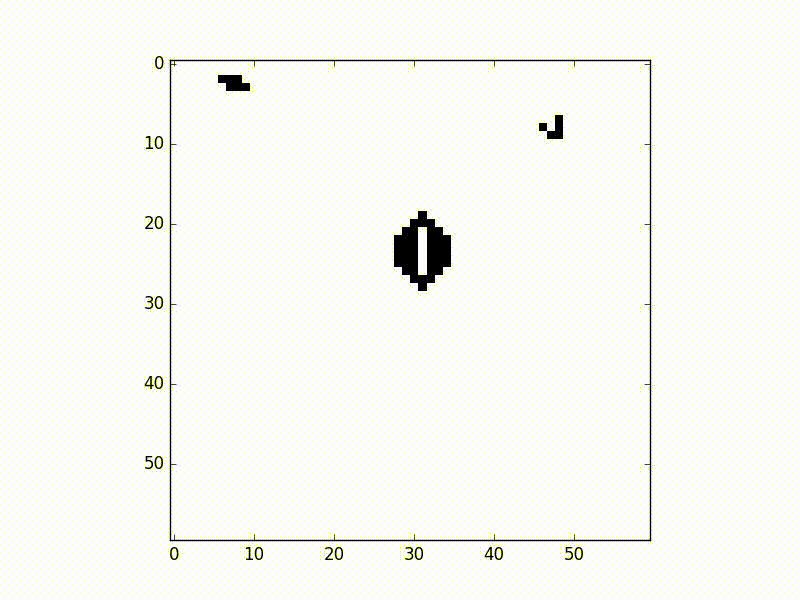

## Some Mathematical Python
The slides and code for a talk on using Python for mathematical research. The slides themselves can be viewed online at [Talk/mathpythonTalk.pdf](Talk/mathpythonTalk.pdf) and the videos [below](#Videos) in GIF format.  To get the full resolution videos to play embedded in the slides download the Talk folder and open the slides in Adobe Acrobat Reader.  

Running the Python code requires Python 3 and some additional libraries which can be installed with
```bash
pip3 install scipy numpy matplotlib sympy jupyter cython
```

I gave this talk as part of the [Computing Seminars](https://www.dur.ac.uk/mathematical.sciences/events/seminars/?id=4950&seminar=4950) for PhD students in the Department of Mathematical Sciences at Durham University, UK.

## Abstract
Python is a general purpose programming language with an emphasis on readability and flexibility and has a well developed ecosystem of scientific computing packages. This makes it an excellent tool for mathematical research, where allowing for rapid iteration and experimentation can often be more important than maximising computational efficiency. I will discuss some of the general features of Python as well as examples of specific applications of interest to mathematicians including efficient matrix operations, symbolic algebra and interactive animations.

## Videos
A soliton solution of the sine-Gordon equation animated in Python


Conway's Game of Life in Python

